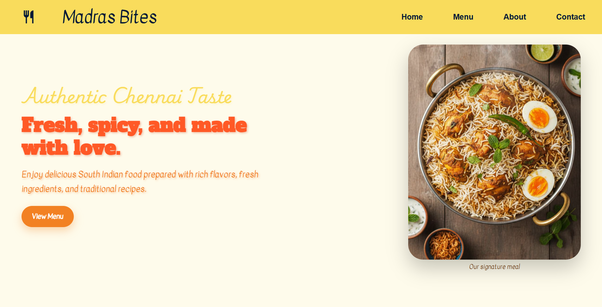
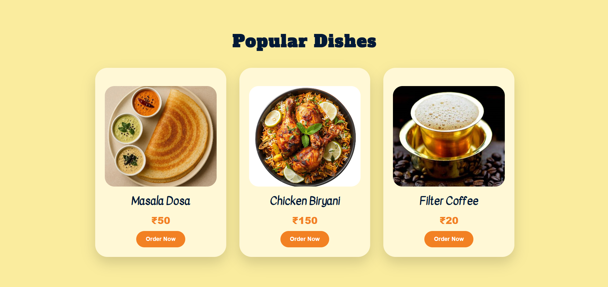

# 🍛 Madras Bites

A Chennai-inspired restaurant landing page built with vanilla HTML, CSS, and JavaScript. Features a clean, vibrant UI with smooth interactions and a fully responsive layout.

---

## 🌐 Live Demo

🔗 [madras-bites.com](https://jbmsacps-stack.github.io/madras-bites/madras%20bites/madrasbites.html)

---

## 📸 Preview




---

## ✨ Features

- **Hide-on-scroll navbar** — header slides away while scrolling down, reappears on scroll up
- **Tamil script hover effect** — the restaurant name switches to Tamil (மெட்ராஸ் பைட்ஸ்) on hover
- **Smooth scroll navigation** — anchor links glide to each section
- **Animated menu cards** — dish cards lift on hover with shadow transitions
- **Responsive design** — adapts cleanly to mobile and tablet screens
- **Google Fonts** — Kavivanar, Alfa Slab One, and Lavishly Yours for authentic feel

---

## 🗂️ Project Structure

```
madras-bites/
├── index.html         # Page structure and content
├── style.css          # Styling, layout, animations, media queries
├── script.js          # Hide-on-scroll navbar logic
└── screenshots/
    ├── screenshot1.png
    └── screenshot2.png
```

---

## 🛠️ Tech Stack

| Technology | Usage |
|---|---|
| HTML5 | Semantic structure (`<section>`, `<article>`, `<figure>`, `<address>`) |
| CSS3 | Flexbox layout, transitions, media queries, custom fonts |
| JavaScript (Vanilla) | Scroll event listener for navbar behavior |
| Google Fonts | Kavivanar, Alfa Slab One, Lavishly Yours |
| Google Material Symbols | Restaurant icon in navbar |

---

## 🚀 Getting Started

1. **Clone the repository**
   ```bash
   git clone https://github.com/jbmsacps-stack/madras-bites.git
   ```

2. **Open in browser**
   ```bash
   cd madras-bites
   open index.html
   ```
   Or just drag `index.html` into your browser.

---

## 📱 Responsive Breakpoints

| Screen Size | Behavior |
|---|---|
| `> 900px` | Side-by-side hero layout, horizontal navbar |
| `≤ 900px` | Stacked hero, centered nav links, scaled-down fonts |

---

## 🙏 Acknowledgements

- Food images sourced from [Pinterest](https://pinterest.com)
- Fonts via [Google Fonts](https://fonts.google.com)
- Icons via [Google Material Symbols](https://fonts.google.com/icons)

---

## ⚠️ Disclaimer

**Madras Bites is a fictional brand created solely for educational and portfolio purposes.**
This website, including its name, logo concept, menu items, pricing, address, and contact details, is entirely made up. Any resemblance to a real restaurant or business is purely coincidental.

Food images used in this project are sourced from Pinterest and remain the property of their respective owners. This project is not intended for commercial use.

---

## 📄 License

This project is open source and available under the [MIT License](https://opensource.org/license/mit).

---

*© 2026 Madras Bites — Fictional brand. All creative work in this repository belongs to the repository owner.*
